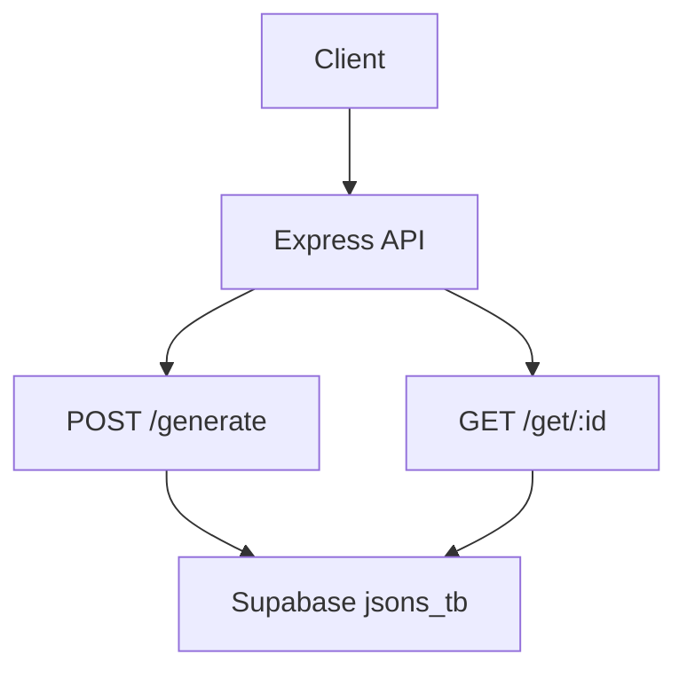
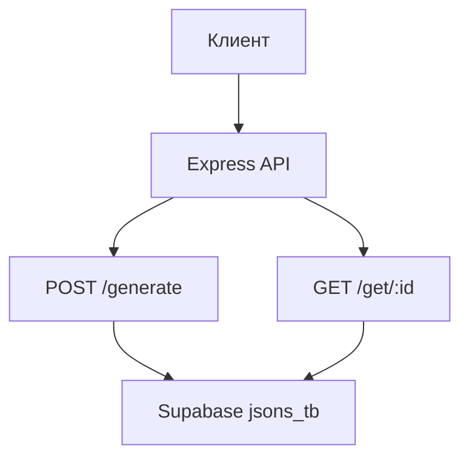

# ApiNodeJs
[](https://github.com/DenisArger/ApiNodeJs/actions/workflows/ci.yml)

## English

## Problem
Small teams often need a lightweight endpoint to store arbitrary JSON and retrieve it by a short link-like identifier.

## Solution
`ApiNodeJs` is an Express service that saves JSON payloads to Supabase and returns a 6-character ID for later retrieval.

## Tech Stack
- Node.js
- Express
- Supabase (`@supabase/supabase-js`)
- NanoID
- CORS
- Netlify config present (`netlify.toml`)

## Architecture
Top-level structure:
```text
assets/
functions/
public/
express.js
supabase.js
generatorId.js
```



## Features
- Save arbitrary JSON via `POST /generate`
- Retrieve JSON via `GET /get/:id`
- ID validation (exactly 6 chars)
- Static asset serving from `assets/`

## How to Run
```bash
npm install
cp .env.example .env
node express.js
```

Server starts on `http://localhost:3000`.

## Русский

## Проблема
Небольшим командам часто нужен простой endpoint, где можно сохранить произвольный JSON и получить его по короткому идентификатору.

## Решение
`ApiNodeJs` — это сервис на Express, который сохраняет JSON в Supabase и возвращает 6-символьный ID для последующего получения.

## Стек
- Node.js
- Express
- Supabase (`@supabase/supabase-js`)
- NanoID
- CORS
- Есть конфиг Netlify (`netlify.toml`)

## Архитектура
Верхнеуровневая структура:
```text
assets/
functions/
public/
express.js
supabase.js
generatorId.js
```



## Возможности
- Сохранение произвольного JSON через `POST /generate`
- Получение JSON через `GET /get/:id`
- Валидация ID (ровно 6 символов)
- Раздача статики из `assets/`

## Как запустить
```bash
npm install
cp .env.example .env
node express.js
```

Сервис поднимается на `http://localhost:3000`.
